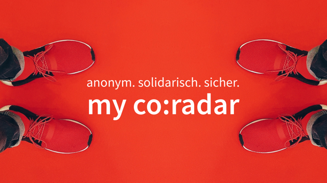
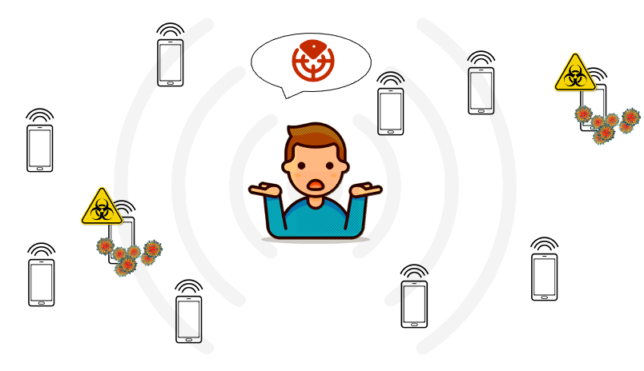

```
Diese Seite ist derzeit nur in deutscher Sprache formuliert, da es sich bei dem Hackathon um eine VEranstaltung des Bundes handelt. Eine Übersetung ist englisch in während oder kurz nach dem Hackathon vorgesehen
```

# my co:radar
<<<<<<< HEAD
anonym. solidarisch. sicher

Eine innovative Lösung für den solidarischen Schutz unserer Gemeinschaft. Anonyme Nutzung sichergestellt und sicher für Deine Gesundheit.
=======
anonym. solidarisch. sicher.
>>>>>>> 1d966ba67e93e89614002f6d0be4dd392e2cd885



## Zweck
<<<<<<< HEAD
Es wurde im Rahmen des Hackathon #WirVsVirus (#WeVsVirus) in 2020 eine Lösung entwickelt werden, die bei der Eindämmung der Krankheit COVID-19 unterstützt (#flattenthecurve #riskgoups). Die Lösung unterstützt Anwender dabei, ihre physischen Kontakte im Blick zu behalten und bei einer Infektion mit COVID-19 sich und andere rechtzeitig zu informieren. Ziel ist die frühzeitige Unterbrechung der Infektionskette und die Eindämmung der Verbreitung von SARS-CoV-2 (#flatenthecurve), damit unser Gesundheitssystem den Kollaps übersteht. Der Einsatz erfolgt dabei konform den Aspekten des Datenschutzes (GDPR/EU-DSGVO).  

## Unsere Idee
Unsere Lösung ermittelt über eindeutige Kennungen von Smartphones, ob sich ein Anwender gemäß den Richtwerten vom Robert-Koch-Institut (RKI) zu lange und zu dicht an einer mit SARS-CoV-2 infizierten Person aufgehalten hat.   

Hierzu prüft die Lösung gemäß der Empfehlung folgende Bedingungen:   

- mindestens zwei Meter Abstand zu anderen Personen halten und   
- nicht länger als 15 Minuten in der Nähe von infizierten Personen aufhalten.   

Kommt man infizierten Personen für einen längeren Zeitraum dicher, besteht möglicherweise das Risiko einer Ansteckung für den Anwender.  
=======
Es soll im Rahmen des Hackathon [#WirVsVirus](https://wirvsvirushackathon.org/) 2020 eine Lösung entwickelt werden, die bei der Eindämmung der Krankheit COVID-19 unterstützt. #flattenthecurve #riskgoups 

## Unsere Idee
Wir möchten über Mobiltelefone ermitteln, ob ein Anwender sich eine bestimmte Zeit in einer bestimmten Nähe zu einem mit SARS-CoV-2 infizierten Menschen aufgehalten hat.

Laut Empfehlung sollte die Entfernung mehr als 2 Meter und nicht länger als 15 Minuten erfolgen. Befindet man sich eine längere Zeit oder dichter an einer infizierten Person, besteht die Möglichkeit, sich ebenfalls zu infizieren.
>>>>>>> 1d966ba67e93e89614002f6d0be4dd392e2cd885



## Technische Umsetzung  
Mit der von uns vorgesehenen Lösung werden von den eigenen Gerät alle Geräte in der Umgebung protokolliert. Die IDs werden ermittelt und als anonyme Kennzeichnung gespeichert.

Von einem zentralen Server-Dienst werden Geräte-IDs von positiv getesteten Nutzern gelesen und der Anwender wird vor einer potentiellen Ansteckung gewarnt, um so die Infektionskette zu unterbrechen.

Wird eine ID erst zu einem späteren Zeitpunkt als infektiös markiert, werden alle früher mit dieser ID in Kontakt stehenden Anwender informiert. Diese Information erfolgt durch eine client-seitige Synchronisierung der Liste mit der als infektiös bekannten IDs.

Meldet ein Anwender sich selber als infektiös, wird seine ID an den Server übertragen und alle mit ihm in Kontakt gestandenen Anwender über den zuvor beschriebenen Mechanismus informiert.

## Features
- Erfassung einer eindeutigen anonymen ID des Geräts
- keine Erfassung von personengebundenen Informationen
- Übertragung der Informationen über verschlüselte Protokolle (in Arbeit)
- ...

## Voraussetzung
- Smartphones
- Einsatz der Anwendung "my co:radar" auf den betroffenen Endgeräten
- Einsatz des Backends für den Austausch der als infektiös identifizierten Anwender
- Internet-Verbindung zur Datensynchronisierung

## Die Technik:
**App**  
- Angular  
- Springboot  
- REST  
- JSON  

**Design**  
- Adobe Spark Post  
- proto.io  

**Kommunikation**  
- Slack
- menti.com
- Zoom

## Der Datenschutz

Die Lösung ermittelt eine eindeutige ID des Geräts und nutzt diese zum Austauch mit anderen Geräten.
<<<<<<< HEAD
=======

>>>>>>> 1d966ba67e93e89614002f6d0be4dd392e2cd885
...
